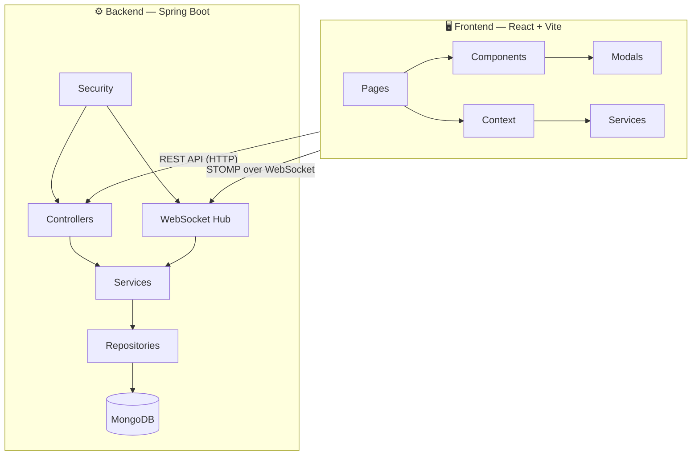
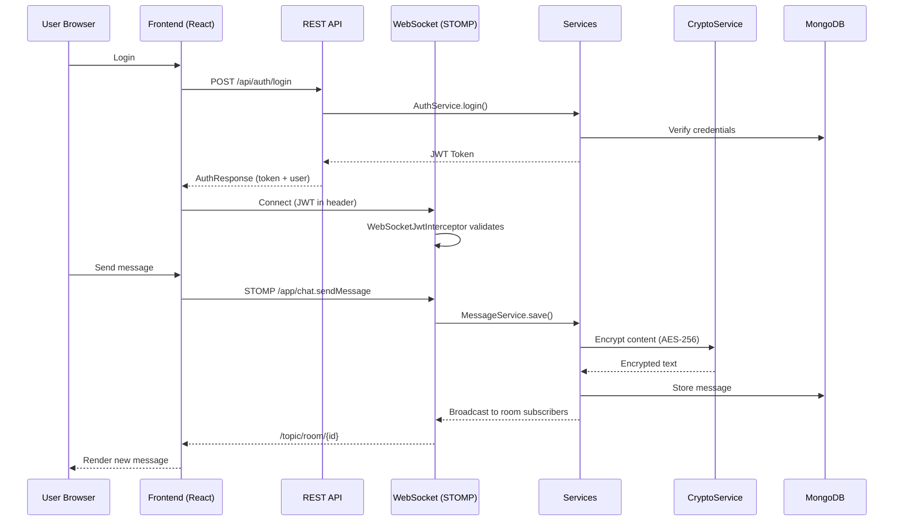

# 🗺️ Chat Application — Project Map

> A full-stack real-time chat app: **Spring Boot + MongoDB** backend with **React (Vite)** frontend, connected via **WebSocket (STOMP)**.

---

## Architecture at a Glance

---

## 📁 Root Files

| File | Purpose |
|------|---------|
| [pom.xml](file:///c:/Users/VINAY/intellije-workspace/chat%20application/pom.xml) | Maven build config — Spring Boot, MongoDB, JWT, WebSocket, Swagger deps |
| [Dockerfile](file:///c:/Users/VINAY/intellije-workspace/chat%20application/Dockerfile) | Builds the Spring Boot JAR into a Docker image |
| [docker-compose.yml](file:///c:/Users/VINAY/intellije-workspace/chat%20application/docker-compose.yml) | Orchestrates the app (port 8081) + MongoDB (port 27017) containers |
| [database-setup.sql](file:///c:/Users/VINAY/intellije-workspace/chat%20application/database-setup.sql) | Initial DB schema / seed script |
| [ReadMe.md](file:///c:/Users/VINAY/intellije-workspace/chat%20application/ReadMe.md) | Project documentation |
| [toDo.md](file:///c:/Users/VINAY/intellije-workspace/chat%20application/toDo.md) | Feature roadmap / task tracker |

---

## ⚙️ Backend — `src/main/java/com/example/chatservice/`

### 🚀 Entry Point

| File | Purpose |
|------|---------|
| [ChatServiceApplication.java](file:///c:/Users/VINAY/intellije-workspace/chat%20application/src/main/java/com/example/chatservice/ChatServiceApplication.java) | Spring Boot main class — bootstraps the entire application |

---

### 🎮 Controller — REST API Endpoints

| File | Purpose |
|------|---------|
| [AuthController.java](file:///c:/Users/VINAY/intellije-workspace/chat%20application/src/main/java/com/example/chatservice/Controller/AuthController.java) | Login & registration endpoints, returns JWT tokens |
| [UserController.java](file:///c:/Users/VINAY/intellije-workspace/chat%20application/src/main/java/com/example/chatservice/Controller/UserController.java) | User CRUD — search, update, block/unblock, manage contacts |
| [ProfileController.java](file:///c:/Users/VINAY/intellije-workspace/chat%20application/src/main/java/com/example/chatservice/Controller/ProfileController.java) | User profile management — avatar upload, bio, display name |
| [RoomController.java](file:///c:/Users/VINAY/intellije-workspace/chat%20application/src/main/java/com/example/chatservice/Controller/RoomController.java) | Chat room CRUD — create, join, leave, rename, manage members |
| [MessageController.java](file:///c:/Users/VINAY/intellije-workspace/chat%20application/src/main/java/com/example/chatservice/Controller/MessageController.java) | Message history, search, pagination for rooms |
| [DataController.java](file:///c:/Users/VINAY/intellije-workspace/chat%20application/src/main/java/com/example/chatservice/Controller/DataController.java) | Generic data/file storage endpoints |
| [PageController.java](file:///c:/Users/VINAY/intellije-workspace/chat%20application/src/main/java/com/example/chatservice/Controller/PageController.java) | Serves the SPA index page (catch-all route) |

---

### 📦 Model — MongoDB Documents

| File | Purpose |
|------|---------|
| [User.java](file:///c:/Users/VINAY/intellije-workspace/chat%20application/src/main/java/com/example/chatservice/Model/User.java) | User document — credentials, roles, contacts, blocked users |
| [ChatRoom.java](file:///c:/Users/VINAY/intellije-workspace/chat%20application/src/main/java/com/example/chatservice/Model/ChatRoom.java) | Chat room document — name, type, creator, settings |
| [Message.java](file:///c:/Users/VINAY/intellije-workspace/chat%20application/src/main/java/com/example/chatservice/Model/Message.java) | Message document — content, sender, timestamp, read receipts |
| [Profile.java](file:///c:/Users/VINAY/intellije-workspace/chat%20application/src/main/java/com/example/chatservice/Model/Profile.java) | User profile document — avatar, bio, display name |
| [RoomMembership.java](file:///c:/Users/VINAY/intellije-workspace/chat%20application/src/main/java/com/example/chatservice/Model/RoomMembership.java) | Tracks which users belong to which rooms + their roles |
| [Role.java](file:///c:/Users/VINAY/intellije-workspace/chat%20application/src/main/java/com/example/chatservice/Model/Role.java) | Role entity (ADMIN, USER, etc.) |
| [ERole.java](file:///c:/Users/VINAY/intellije-workspace/chat%20application/src/main/java/com/example/chatservice/Model/ERole.java) | Enum defining available role types |
| [DataEntity.java](file:///c:/Users/VINAY/intellije-workspace/chat%20application/src/main/java/com/example/chatservice/Model/DataEntity.java) | Generic data/file storage document |

---

### 📨 Dto — Request & Response Shapes

#### Requests (incoming payloads)

| File | Purpose |
|------|---------|
| [LoginRequest.java](file:///c:/Users/VINAY/intellije-workspace/chat%20application/src/main/java/com/example/chatservice/Dto/request/LoginRequest.java) | Login form: username + password |
| [RegisterRequest.java](file:///c:/Users/VINAY/intellije-workspace/chat%20application/src/main/java/com/example/chatservice/Dto/request/RegisterRequest.java) | Registration form: full user details |
| [CreateRoomRequest.java](file:///c:/Users/VINAY/intellije-workspace/chat%20application/src/main/java/com/example/chatservice/Dto/request/CreateRoomRequest.java) | Basic room creation payload |
| [CreateRoomWithOptionsRequest.java](file:///c:/Users/VINAY/intellije-workspace/chat%20application/src/main/java/com/example/chatservice/Dto/request/CreateRoomWithOptionsRequest.java) | Room creation with advanced options |
| [JoinRoomRequest.java](file:///c:/Users/VINAY/intellije-workspace/chat%20application/src/main/java/com/example/chatservice/Dto/request/JoinRoomRequest.java) | Join a room by ID |
| [RenameRoomRequest.java](file:///c:/Users/VINAY/intellije-workspace/chat%20application/src/main/java/com/example/chatservice/Dto/request/RenameRoomRequest.java) | Rename an existing room |
| [DirectMessageRequest.java](file:///c:/Users/VINAY/intellije-workspace/chat%20application/src/main/java/com/example/chatservice/Dto/request/DirectMessageRequest.java) | Start a 1-on-1 DM conversation |
| [DataRequest.java](file:///c:/Users/VINAY/intellije-workspace/chat%20application/src/main/java/com/example/chatservice/Dto/request/DataRequest.java) | Generic data upload payload |

#### Responses (outgoing payloads)

| File | Purpose |
|------|---------|
| [AuthResponse.java](file:///c:/Users/VINAY/intellije-workspace/chat%20application/src/main/java/com/example/chatservice/Dto/response/AuthResponse.java) | JWT token + user info after login/register |
| [UserSummaryResponse.java](file:///c:/Users/VINAY/intellije-workspace/chat%20application/src/main/java/com/example/chatservice/Dto/response/UserSummaryResponse.java) | Lightweight user info for lists and search |
| [MessageDto.java](file:///c:/Users/VINAY/intellije-workspace/chat%20application/src/main/java/com/example/chatservice/Dto/response/MessageDto.java) | Message data sent to the frontend |
| [MessageReceiptDto.java](file:///c:/Users/VINAY/intellije-workspace/chat%20application/src/main/java/com/example/chatservice/Dto/response/MessageReceiptDto.java) | Read receipt confirmation data |
| [MessageResponse.java](file:///c:/Users/VINAY/intellije-workspace/chat%20application/src/main/java/com/example/chatservice/Dto/response/MessageResponse.java) | Paginated message list wrapper |
| [DataResponse.java](file:///c:/Users/VINAY/intellije-workspace/chat%20application/src/main/java/com/example/chatservice/Dto/response/DataResponse.java) | Generic data operation response |

#### WebSocket DTOs

| File | Purpose |
|------|---------|
| [ChatMessage.java](file:///c:/Users/VINAY/intellije-workspace/chat%20application/src/main/java/com/example/chatservice/Dto/ChatMessage.java) | Real-time message payload over STOMP |
| [DataPayload.java](file:///c:/Users/VINAY/intellije-workspace/chat%20application/src/main/java/com/example/chatservice/Dto/DataPayload.java) | Generic data payload for WebSocket events |

---

### 🔧 Service — Business Logic

| File | Purpose |
|------|---------|
| [AuthService.java](file:///c:/Users/VINAY/intellije-workspace/chat%20application/src/main/java/com/example/chatservice/service/AuthService.java) | Handles login/register logic, password hashing, JWT generation |
| [UserService.java](file:///c:/Users/VINAY/intellije-workspace/chat%20application/src/main/java/com/example/chatservice/service/UserService.java) | User management — search, update, contacts, blocking |
| [ChatRoomService.java](file:///c:/Users/VINAY/intellije-workspace/chat%20application/src/main/java/com/example/chatservice/service/ChatRoomService.java) | Room lifecycle — create, join, leave, permissions, membership |
| [MessageService.java](file:///c:/Users/VINAY/intellije-workspace/chat%20application/src/main/java/com/example/chatservice/service/MessageService.java) | Message CRUD, encryption, read receipts, history |
| [ProfileService.java](file:///c:/Users/VINAY/intellije-workspace/chat%20application/src/main/java/com/example/chatservice/service/ProfileService.java) | Profile management — avatar handling, bio updates |
| [CryptoService.java](file:///c:/Users/VINAY/intellije-workspace/chat%20application/src/main/java/com/example/chatservice/service/CryptoService.java) | AES-256 encryption/decryption for message content |
| [DataService.java](file:///c:/Users/VINAY/intellije-workspace/chat%20application/src/main/java/com/example/chatservice/service/DataService.java) | Generic data storage operations |
| [MyUserDetailsService.java](file:///c:/Users/VINAY/intellije-workspace/chat%20application/src/main/java/com/example/chatservice/service/MyUserDetailsService.java) | Spring Security UserDetailsService implementation |

---

### 🗄️ Repository — MongoDB Data Access

| File | Purpose |
|------|---------|
| [UserRepository.java](file:///c:/Users/VINAY/intellije-workspace/chat%20application/src/main/java/com/example/chatservice/repository/UserRepository.java) | User queries — find by username/email, search |
| [ChatRoomRepository.java](file:///c:/Users/VINAY/intellije-workspace/chat%20application/src/main/java/com/example/chatservice/repository/ChatRoomRepository.java) | Room queries — find by name, type, members |
| [MessageRepository.java](file:///c:/Users/VINAY/intellije-workspace/chat%20application/src/main/java/com/example/chatservice/repository/MessageRepository.java) | Message queries — by room, pagination, search |
| [ProfileRepository.java](file:///c:/Users/VINAY/intellije-workspace/chat%20application/src/main/java/com/example/chatservice/repository/ProfileRepository.java) | Profile lookups by user ID |
| [RoomMembershipRepository.java](file:///c:/Users/VINAY/intellije-workspace/chat%20application/src/main/java/com/example/chatservice/repository/RoomMembershipRepository.java) | Membership queries — who's in what room |
| [RoleRepository.java](file:///c:/Users/VINAY/intellije-workspace/chat%20application/src/main/java/com/example/chatservice/repository/RoleRepository.java) | Role lookups |
| [DataRepository.java](file:///c:/Users/VINAY/intellije-workspace/chat%20application/src/main/java/com/example/chatservice/repository/DataRepository.java) | Generic data entity access |

---

### 🔐 Security — Auth & JWT

| File | Purpose |
|------|---------|
| [SecurityConfig.java](file:///c:/Users/VINAY/intellije-workspace/chat%20application/src/main/java/com/example/chatservice/security/SecurityConfig.java) | Spring Security filter chain — CORS, CSRF, endpoint rules |
| [JwtService.java](file:///c:/Users/VINAY/intellije-workspace/chat%20application/src/main/java/com/example/chatservice/security/JwtService.java) | JWT token generation, validation, and parsing |
| [JwtAuthenticationFilter.java](file:///c:/Users/VINAY/intellije-workspace/chat%20application/src/main/java/com/example/chatservice/security/JwtAuthenticationFilter.java) | Intercepts HTTP requests to validate JWT from headers |
| [UserPrincipal.java](file:///c:/Users/VINAY/intellije-workspace/chat%20application/src/main/java/com/example/chatservice/security/UserPrincipal.java) | Wraps User into Spring Security's principal object |

---

### 🔌 WebSocket — Real-Time Messaging

| File | Purpose |
|------|---------|
| [WebSocketConfig.java](file:///c:/Users/VINAY/intellije-workspace/chat%20application/src/main/java/com/example/chatservice/websocket/WebSocketConfig.java) | Configures STOMP endpoints and message broker |
| [ChatMessagingController.java](file:///c:/Users/VINAY/intellije-workspace/chat%20application/src/main/java/com/example/chatservice/websocket/ChatMessagingController.java) | Handles real-time messages — send, typing indicators, read receipts |
| [WebSocketEventListener.java](file:///c:/Users/VINAY/intellije-workspace/chat%20application/src/main/java/com/example/chatservice/websocket/WebSocketEventListener.java) | Tracks connect/disconnect events, manages online status |
| [WebSocketJwtInterceptor.java](file:///c:/Users/VINAY/intellije-workspace/chat%20application/src/main/java/com/example/chatservice/websocket/WebSocketJwtInterceptor.java) | Authenticates WebSocket connections using JWT tokens |

---

### ⚙️ Config — App Configuration

| File | Purpose |
|------|---------|
| [WebConfig.java](file:///c:/Users/VINAY/intellije-workspace/chat%20application/src/main/java/com/example/chatservice/config/WebConfig.java) | CORS settings, static resource serving |
| [MongoConfig.java](file:///c:/Users/VINAY/intellije-workspace/chat%20application/src/main/java/com/example/chatservice/config/MongoConfig.java) | MongoDB connection and auditing config |
| [OpenApiConfig.java](file:///c:/Users/VINAY/intellije-workspace/chat%20application/src/main/java/com/example/chatservice/config/OpenApiConfig.java) | Swagger/OpenAPI documentation setup |

---

### ❌ Exception — Error Handling

| File | Purpose |
|------|---------|
| [GlobalExceptionHandler.java](file:///c:/Users/VINAY/intellije-workspace/chat%20application/src/main/java/com/example/chatservice/exception/GlobalExceptionHandler.java) | Central @ControllerAdvice — catches all exceptions, returns clean error responses |
| [ResourceNotFoundException.java](file:///c:/Users/VINAY/intellije-workspace/chat%20application/src/main/java/com/example/chatservice/exception/ResourceNotFoundException.java) | 404 — requested entity not found |
| [DuplicateResourceException.java](file:///c:/Users/VINAY/intellije-workspace/chat%20application/src/main/java/com/example/chatservice/exception/DuplicateResourceException.java) | 409 — entity already exists |
| [AuthenticationFailedException.java](file:///c:/Users/VINAY/intellije-workspace/chat%20application/src/main/java/com/example/chatservice/exception/AuthenticationFailedException.java) | 401 — bad credentials |

---

### 📝 Resources

| File | Purpose |
|------|---------|
| [application.properties](file:///c:/Users/VINAY/intellije-workspace/chat%20application/src/main/resources/application.properties) | App config — port 8081, MongoDB URI, JWT secret, encryption key |

---

## 🖥️ Frontend — `frontend/src/`

### 🏗️ App Shell

| File | Purpose |
|------|---------|
| [main.jsx](file:///c:/Users/VINAY/intellije-workspace/chat%20application/frontend/src/main.jsx) | React entry point — mounts the app to DOM |
| [App.jsx](file:///c:/Users/VINAY/intellije-workspace/chat%20application/frontend/src/App.jsx) | Root component — routing, context providers |
| [App.css](file:///c:/Users/VINAY/intellije-workspace/chat%20application/frontend/src/App.css) | App-level styles |
| [index.css](file:///c:/Users/VINAY/intellije-workspace/chat%20application/frontend/src/index.css) | Global base styles and CSS resets |
| [vite.config.js](file:///c:/Users/VINAY/intellije-workspace/chat%20application/frontend/vite.config.js) | Vite build config — dev server proxy, plugins |

---

### 📄 Pages — Top-Level Views

| File | Purpose |
|------|---------|
| [Login.jsx](file:///c:/Users/VINAY/intellije-workspace/chat%20application/frontend/src/pages/Login.jsx) | Login page — username/password form |
| [Register.jsx](file:///c:/Users/VINAY/intellije-workspace/chat%20application/frontend/src/pages/Register.jsx) | Registration page — full signup form |
| [Chat.jsx](file:///c:/Users/VINAY/intellije-workspace/chat%20application/frontend/src/pages/Chat.jsx) | Main chat page — assembles Sidebar + ChatArea + panels |

---

### 🧩 Components — Reusable UI Blocks

| File | Purpose |
|------|---------|
| [Sidebar.jsx](file:///c:/Users/VINAY/intellije-workspace/chat%20application/frontend/src/components/Sidebar.jsx) | Left panel — room list, search, navigation |
| [ChatArea.jsx](file:///c:/Users/VINAY/intellije-workspace/chat%20application/frontend/src/components/ChatArea.jsx) | Main chat area — message list, input box, send button |
| [ContactInfoPanel.jsx](file:///c:/Users/VINAY/intellije-workspace/chat%20application/frontend/src/components/ContactInfoPanel.jsx) | Right panel — shows user/room details when clicked |
| [MembersPanel.jsx](file:///c:/Users/VINAY/intellije-workspace/chat%20application/frontend/src/components/MembersPanel.jsx) | Displays room member list with roles and actions |

---

### 🪟 Modals — Popup Dialogs

| File | Purpose |
|------|---------|
| [JoinCreateRoomModal.jsx](file:///c:/Users/VINAY/intellije-workspace/chat%20application/frontend/src/components/modals/JoinCreateRoomModal.jsx) | Create a new room or join an existing one |
| [DirectMessageModal.jsx](file:///c:/Users/VINAY/intellije-workspace/chat%20application/frontend/src/components/modals/DirectMessageModal.jsx) | Start a new DM with a user |
| [ProfileModal.jsx](file:///c:/Users/VINAY/intellije-workspace/chat%20application/frontend/src/components/modals/ProfileModal.jsx) | View/edit user profile — avatar, bio, settings |

---

### 🌐 Context — Global State Management

| File | Purpose |
|------|---------|
| [AuthContext.jsx](file:///c:/Users/VINAY/intellije-workspace/chat%20application/frontend/src/context/AuthContext.jsx) | Auth state — current user, JWT token, login/logout functions |
| [WebSocketContext.jsx](file:///c:/Users/VINAY/intellije-workspace/chat%20application/frontend/src/context/WebSocketContext.jsx) | WebSocket connection — STOMP client, subscriptions, online status |
| [ToastContext.jsx](file:///c:/Users/VINAY/intellije-workspace/chat%20application/frontend/src/context/ToastContext.jsx) | Toast notification system — success/error/info popups |

---

### 📡 Services — API Layer

| File | Purpose |
|------|---------|
| [api.js](file:///c:/Users/VINAY/intellije-workspace/chat%20application/frontend/src/services/api.js) | Axios instance — base URL, JWT interceptor, all HTTP calls |

---

## 🔄 Data Flow Summary

